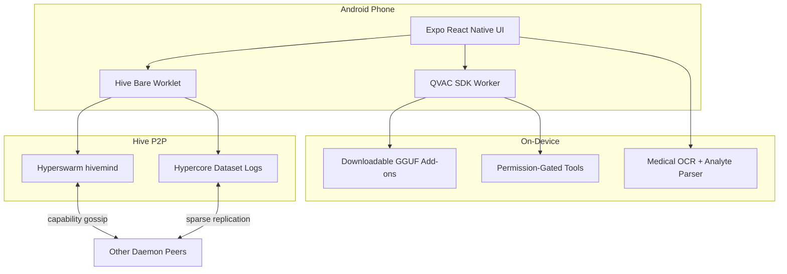

# Daemon Hive Swarm

**Private, local AI meets a decentralized P2P agent swarm — built for your pocket.**

Submission for **[QVAC Hackathon I — Unleash Edge AI](https://dorahacks.io/hackathon/qvac-unleach-edge-ai-i/tracks)** · **Mobile track**

---

## Submission snapshot

| Field | Detail |
| --- | --- |
| **Project** | Daemon Hive Swarm (`daemon-hive-swarm`) |
| **Track** | [Mobile](https://dorahacks.io/hackathon/qvac-unleach-edge-ai-i/tracks) — retail Android smartphones |
| **Platform** | Android (Expo + QVAC SDK + BareKit) |
| **Package** | `io.daemon.mobile` |
| **Website** | Product narrative lives in [`website/`](website/) (Next.js landing) |

**Hackathon requirements:** public Git repository + demo video. This README is written as the prepared initial-commit overview for judges and reviewers.

---

## Vision

Billions of phones sit underused while high-value personal data — health records, motion patterns, daily context — rarely leaves the device in a safe, useful form. Cloud assistants solve convenience by centralizing inference and data. That tradeoff breaks down for medical records, wallet activity, and anything users refuse to ship to a remote API.

**Daemon** is our answer: a **private agent that lives on the phone**, runs inference locally through **QVAC**, and optionally joins the **Hive** — a peer network where devices share spare compute and opt-in, anonymized datasets without a central server.

> *Join a swarm of private, on-device agents capable of sharing inference and high-value data.*

The long-term goal is a consumer agent mesh: personal AI by default, swarm coordination when it helps, and contributor rewards when users choose to participate.

---

## What Daemon does

### Your agent stays on your device

- **Chat, voice, OCR, vision, and tools** run through QVAC inside a Bare worklet boundary — not as fragile React Native UI glue code.
- **Models are add-ons**, not baked into the APK. Users download the weights they want after onboarding.
- **Cloud inference is opt-in only** — add API keys to the local vault and switch chat to online mode.
- **Permission-gated tools** for device context, files, calendar, web search, onchain analysis, and wallet-aware actions.

### A swarm of private agents (Hive)

- Peers discover each other on a shared **Hyperswarm** topic (`hivemind`).
- Devices exchange **signed capability manifests** — model inventory, dataset opt-ins, provider availability — not private files.
- **Delegated inference**: a phone can offload heavier QVAC workloads to another peer that advertises capacity.
- Separate **Hypercore replication topic** for dataset sync without mixing P2P gossip and replication protocols.

### Contribute to open datasets (Hypercore)

- **Seven dataset types**, each individually opt-in: Motion IMU, Activity + Steps, Environment Context, Network Quality, Inference Performance, App Usage + Preferences, and **Medical Reports**.
- Records append to **Corestore + Hypercore** (one log per dataset) under Pear/Holepunch-style local storage — not a monolithic JSON file.
- **No raw prompts or documents leave the device.** Medical shares are de-identified on-device before any append.

### Share compute or data. Get paid.

- Toggle datasets one at a time; advertise QVAC provider capacity when opted in.
- Contributor rewards surface as **USDC pending** in the agent wallet flow (prototype incentives layer).

---

## Why this fits the Mobile track

The [QVAC Mobile track](https://dorahacks.io/hackathon/qvac-unleach-edge-ai-i/tracks) asks for **fully on-device mobile applications** that deliver private AI in the user's pocket — with bonus credit for multimodal flows, sensor use, and P2P delegation.

Daemon Hive Swarm maps directly:

| Hackathon focus | Daemon implementation |
| --- | --- |
| Personal offline assistant | QVAC llama.cpp chat + tool-calling agents; default local mode |
| Health / wellness / MedPsy | MedPsy model slot; medical PDF/image pipeline with on-device OCR |
| Multimodal mobile | Camera OCR (QVAC + ML Kit), Gemma 4 vision, Whisper voice loop, Supertonic TTS |
| Privacy-first vs cloud apps | Local-first vault; anonymized Hypercore shares; no default cloud path |
| Mobile sensors + features | Expo sensors for IMU, pedometer, environment; Usage Access hooks |
| P2P delegation | Hive Hyperswarm discovery + signed provider manifests + QVAC delegate path |

---

## Architecture



### Runtime boundaries

1. **UI layer** — Expo React Native agent shell: onboarding, chat, tools, Hive marketplace, medical share wizard.
2. **QVAC worker** — BareKit bundle for llama.cpp completion, embeddings, Whisper transcription, ONNX OCR/TTS, dynamic tool calling.
3. **Hive worklet** — Separate Bare bundle: Hyperswarm transport, Corestore, per-dataset Hypercores, RPC bridge to the app.

This separation keeps heavy inference and P2P storage off the JS UI thread — a requirement for credible mobile edge AI.

---

## QVAC integration (implementation detail)

### Models (download after install)

Defined in `src/runtime/modelManifest.ts`. No weights ship in the repository or initial APK.

| Model | Role | Notes |
| --- | --- | --- |
| Qwen 3.5 0.8B / 2B / 4B | Chat + tool agent | Mobile tool-calling via QVAC dynamic tools |
| Gemma 4 E2B | Vision | Multimodal mmproj + completion |
| MedPsy 1.7B | Health reasoning | QVAC registry path for wellness/clinical-adjacent flows |
| QVAC Latin OCR | Document OCR | Fallback after ML Kit on PDFs/images |
| Whisper + Supertonic | Voice | Transcription + on-device TTS replies |

### QVAC capabilities used

- **Llama.cpp completion** with tool schemas (device, wallet, onchain, files, vision, web).
- **Whisper.cpp** transcription with voice-turn UX.
- **ONNX OCR** and **ONNX TTS** for document and spoken interfaces.
- **Embeddings** for local memory / retrieval paths.
- **Optional GPU offload** via Fabric llama.cpp backends (Vulkan/OpenCL) on supported Android chipsets.
- **Delegated provider** path when a Hive peer advertises QVAC capacity.

### Medical document pipeline

End-to-end on device — aligned with privacy-first health use cases:

1. User picks PDF/image reports via document picker.
2. **PDF text scrape** (FlateDecode streams) with garbage detection.
3. **ML Kit OCR** on embedded page images; **QVAC OCR** fallback.
4. Progressive **analyte extraction** (structured lab values, units, range buckets).
5. **De-identification** before review (names, dates, IDs stripped from share payload).
6. User confirms → append anonymized record to **`medical-reports` Hypercore**.

> **Disclaimer:** Daemon is a hackathon prototype for private on-device document processing and anonymized research datasets. It is **not** a medical device, diagnostic tool, or substitute for professional care. Teams commercializing health features must perform their own regulatory diligence.

---

## Hive datasets (Hypercore / Corestore)

| Dataset ID | Category | Source |
| --- | --- | --- |
| `motion-imu` | Sensors | Accelerometer, gyroscope, device motion buckets |
| `activity-pedometer` | Sensors | Step deltas, activity intensity |
| `environment-context` | Sensors | Light, barometer, magnetometer trends |
| `network-quality` | Device | Connection class, latency buckets |
| `device-performance` | Device | Tokens/sec, memory tier, thermal flags |
| `app-usage-preferences` | Device | Category/session buckets (Usage Access) |
| `medical-reports` | Medical | De-identified analyte summaries (user-picked files) |

Storage path: `{documentDirectory}/pear-holepunch/corestore/` with one named Hypercore per dataset. Legacy JSONL shares migrate once on first init.

P2P:

- **`hivemind` topic** — signed JSON capability + memory-summary gossip.
- **`hive-corestore` topic** — Corestore replication stream only.

---

## Tech stack

| Layer | Technology |
| --- | --- |
| Mobile shell | Expo SDK 54, React Native 0.81 |
| Edge inference | [QVAC SDK](https://github.com/qvac/qvac) + BareKit worklets |
| P2P transport | Hyperswarm, HyperDHT |
| Dataset persistence | Corestore, Hypercore (Pear building blocks) |
| On-device OCR | ML Kit Text Recognition + QVAC OCR |
| Wallet / agents | Solana Mobile Wallet Adapter, Mantle RPC (optional surfaces) |

---

## Repository layout

```text
daemon-hive-swarm/
├── App.tsx                 # Main agent UI
├── src/
│   ├── runtime/            # QVAC client, medical analysis, Hive datasets
│   ├── hive/               # Bare Hive backend + Corestore store
│   └── components/         # Medical wizard, voice, dialogs
├── qvac/                   # QVAC worker bundle entry
├── website/                # Product landing (Next.js)
├── minds/                  # Animoca Minds skill package
└── android/                # Standalone APK build
```

---

## Quick start

**Requirements:** Node.js ≥ 22, Android SDK, physical Android device (ARM64 recommended for QVAC).

```powershell
git clone <your-repo-url>
cd daemon-hive-swarm
npm install
Copy-Item .env.example .env
```

Sync QVAC + Hive Bare bundles and install on device:

```powershell
npm run android:install-device
```

Typecheck:

```powershell
npm run typecheck
```

Run the product website locally:

```powershell
cd website
npm install
npm run dev
```

---

## Demo video script (suggested)

For judges, show this flow in ~3 minutes:

1. **Onboarding** — pick a local QVAC model; enable tools.
2. **Local chat** — airplane mode or no cloud keys; agent answers on-device.
3. **Multimodal** — photograph or upload a lab PDF; progressive analyte extraction.
4. **Medical share** — review de-identified fields; confirm Hive append.
5. **Hive** — join swarm; show peer count + dataset toggles + capability broadcast.
6. **Optional** — voice turn or delegate to a peer provider.

---

## FAQ

**Does my data leave my phone?**  
Not by default. Prompts and raw documents stay local. Dataset shares are anonymized on-device before Hypercore append.

**Do I need a wallet?**  
No for local chat. Yes for onchain tools, agent funding, or contributor rewards.

**Can I use cloud models?**  
Only if you add API keys and enable online mode. Local inference is the default.

**Which devices work?**  
Android phones with enough RAM for chosen QVAC models (0.8B–4B+ depending on selection). GPU offload available on supported chipsets.

---

## License & notices

Hackathon submission prototype. Model weights are downloaded from third-party registries (Hugging Face, QVAC registry) at runtime — not redistributed in this repository.

QVAC, Holepunch/Pear, Hyperswarm, and Hypercore are ecosystems we build on; this project is an independent hackathon entry.

---

**Daemon Hive Swarm** — local inference, swarm coordination, privacy-preserving datasets. Built with QVAC on Android.
