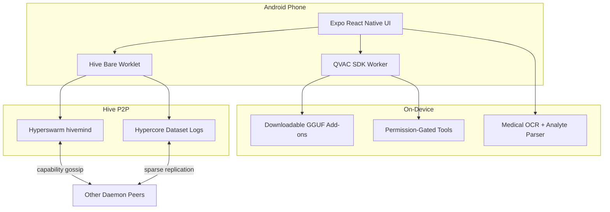

# Daemon Hive Swarm

Private, local AI on Android with optional P2P swarm coordination and opt-in dataset sharing.

Entry for [QVAC Hackathon I - Unleash Edge AI](https://dorahacks.io/hackathon/qvac-unleach-edge-ai-i/tracks), Mobile track.

**Repository:** https://github.com/pharoxe/daemon-hive-swarm  
**Platform:** Android (`io.daemon.mobile`)  
**Landing site:** [`website/`](website/)

---

## Summary

Daemon is a mobile agent that runs QVAC inference on the phone. Chat, voice, OCR, vision, and tools stay on-device by default. Users can join the Hive, a peer network where devices gossip signed capability manifests, replicate anonymized dataset logs, and optionally delegate heavier QVAC workloads to peers that advertise capacity.

Medical PDFs and images can be parsed on the phone, de-identified, and appended to a local Hypercore log if the user opts in. No raw documents or prompts are broadcast by default.

---

## Problem

Phones carry useful context (health files, motion, usage patterns) but most assistants send that data to remote APIs. Cloud inference is convenient, but it is a poor fit for medical records, wallet activity, and anything users want to keep local.

Daemon keeps the agent on the device and treats the swarm as optional: join when you want shared compute or dataset contribution, stay offline when you do not.

---

## Features

### Local agent

- Chat, voice, OCR, vision, and tools through QVAC inside a Bare worklet (not on the RN UI thread).
- Models are add-ons downloaded after install; weights are not bundled in the APK.
- Cloud inference is opt-in via API keys stored in the local vault.
- Permission-gated tools for device context, files, calendar, web search, onchain analysis, and wallet actions.

### Hive (P2P)

- Peer discovery on a shared Hyperswarm topic (`hivemind`).
- Signed capability manifests (model inventory, dataset opt-ins, provider availability).
- Delegated inference when a peer advertises QVAC capacity.
- Separate Hypercore replication topic (`hive-corestore`) so gossip and dataset sync do not share one channel.

### Datasets (Hypercore)

Seven dataset types, each toggled independently:

| Dataset ID | Category | Source |
| --- | --- | --- |
| `motion-imu` | Sensors | Accelerometer, gyroscope, device motion |
| `activity-pedometer` | Sensors | Step deltas, activity intensity |
| `environment-context` | Sensors | Light, barometer, magnetometer |
| `network-quality` | Device | Connection class, latency buckets |
| `device-performance` | Device | Tokens/sec, memory tier, thermal flags |
| `app-usage-preferences` | Device | Category/session buckets (Usage Access) |
| `medical-reports` | Medical | De-identified analyte summaries from user-picked files |

Records append to Corestore-backed Hypercores under `{documentDirectory}/pear-holepunch/corestore/`. Legacy JSONL shares migrate once on first init.

### Incentives (prototype)

Dataset and provider toggles feed a contributor rewards view in the agent wallet flow (USDC pending in the current build).

---

## Mobile track alignment

| Track focus | Implementation |
| --- | --- |
| Personal offline assistant | QVAC llama.cpp chat + tool-calling agents; local mode is default |
| Health / wellness / MedPsy | MedPsy model slot; on-device medical PDF/image pipeline |
| Multimodal mobile | Camera OCR (QVAC + ML Kit), Gemma 4 vision, Whisper voice, Supertonic TTS |
| Privacy-first | Local vault; anonymized Hypercore shares; no default cloud path |
| Mobile sensors | Expo sensors for IMU, pedometer, environment; Usage Access hooks |
| P2P delegation | Hyperswarm discovery + signed provider manifests + QVAC delegate path |

---

## Architecture



**UI layer** - Expo React Native shell: onboarding, chat, tools, Hive marketplace, medical share wizard.

**QVAC worker** - BareKit bundle for llama.cpp completion, embeddings, Whisper, ONNX OCR/TTS, dynamic tool calling.

**Hive worklet** - Bare bundle for Hyperswarm, Corestore, per-dataset Hypercores, RPC bridge to the app.

---

## QVAC models

Defined in `src/runtime/modelManifest.ts`. Weights download at runtime from Hugging Face and the QVAC registry.

| Model | Role |
| --- | --- |
| Qwen 3.5 0.8B / 2B / 4B | Chat + tool agent |
| Gemma 4 E2B | Vision (mmproj + completion) |
| MedPsy 1.7B | Health-oriented reasoning |
| QVAC Latin OCR | Document OCR fallback after ML Kit |
| Whisper + Supertonic | Transcription + on-device TTS |

GPU offload via Fabric llama.cpp backends (Vulkan/OpenCL) on supported Android chipsets.

### Medical document flow

1. User picks PDF or image reports.
2. PDF text scrape (FlateDecode) with noise filtering.
3. ML Kit OCR on embedded images; QVAC OCR fallback.
4. Progressive analyte extraction (values, units, reference ranges).
5. De-identification before review.
6. User confirms, then append to the `medical-reports` Hypercore.

**Disclaimer:** Hackathon prototype for on-device document processing and anonymized research datasets. Not a medical device or diagnostic tool.

---

## Tech stack

| Layer | Technology |
| --- | --- |
| Mobile shell | Expo SDK 54, React Native 0.81 |
| Edge inference | [QVAC SDK](https://github.com/qvac/qvac) + BareKit worklets |
| P2P transport | Hyperswarm, HyperDHT |
| Dataset persistence | Corestore, Hypercore |
| On-device OCR | ML Kit Text Recognition + QVAC OCR |
| Wallet | Solana Mobile Wallet Adapter |

---

## Repository layout

```text
daemon-hive-swarm/
├── App.tsx                 # Main agent UI
├── src/
│   ├── runtime/            # QVAC client, medical analysis, Hive datasets
│   ├── hive/               # Bare Hive backend + Corestore store
│   └── components/         # Medical wizard, voice, dialogs
├── qvac/                   # QVAC worker bundle entry
├── website/                # Product landing (Next.js)
├── minds/                  # Animoca Minds skill package
└── android/                # Standalone APK build (generated by prebuild)
```

---

## Quick start

**Requirements:** Node.js 22+, Android SDK, physical Android device (ARM64 recommended).

```powershell
git clone https://github.com/pharoxe/daemon-hive-swarm.git
cd daemon-hive-swarm
npm install
Copy-Item .env.example .env
```

Install on a connected device:

```powershell
npm run android:install-device
```

Typecheck:

```powershell
npm run typecheck
```

Run the landing site:

```powershell
cd website
npm install
npm run dev
```

---

## Demo outline

Typical walkthrough (~3 minutes):

1. Onboarding: download a local QVAC model, enable tools.
2. Local chat with no cloud keys (airplane mode works).
3. Upload or photograph a lab PDF; watch analyte extraction.
4. Medical share wizard: review de-identified fields, confirm Hive append.
5. Hive tab: join swarm, peer count, dataset toggles.
6. Optional: voice turn or delegate inference to a peer provider.

---

## FAQ

**Does data leave the phone by default?**  
No. Prompts and raw documents stay local. Dataset shares are anonymized on-device before Hypercore append.

**Is a wallet required?**  
No for local chat. Yes for onchain tools, agent funding, or contributor rewards.

**Can I use cloud models?**  
Only after adding API keys and enabling online mode.

**Which devices are supported?**  
Android phones with enough RAM for the chosen QVAC model (roughly 0.8B-4B+ depending on selection). GPU offload on supported chipsets.

---

## License and notices

Hackathon submission prototype. Model weights are downloaded from third-party registries at runtime and are not redistributed here.

Built with QVAC, Holepunch/Pear, Hyperswarm, and Hypercore. Independent hackathon entry.
