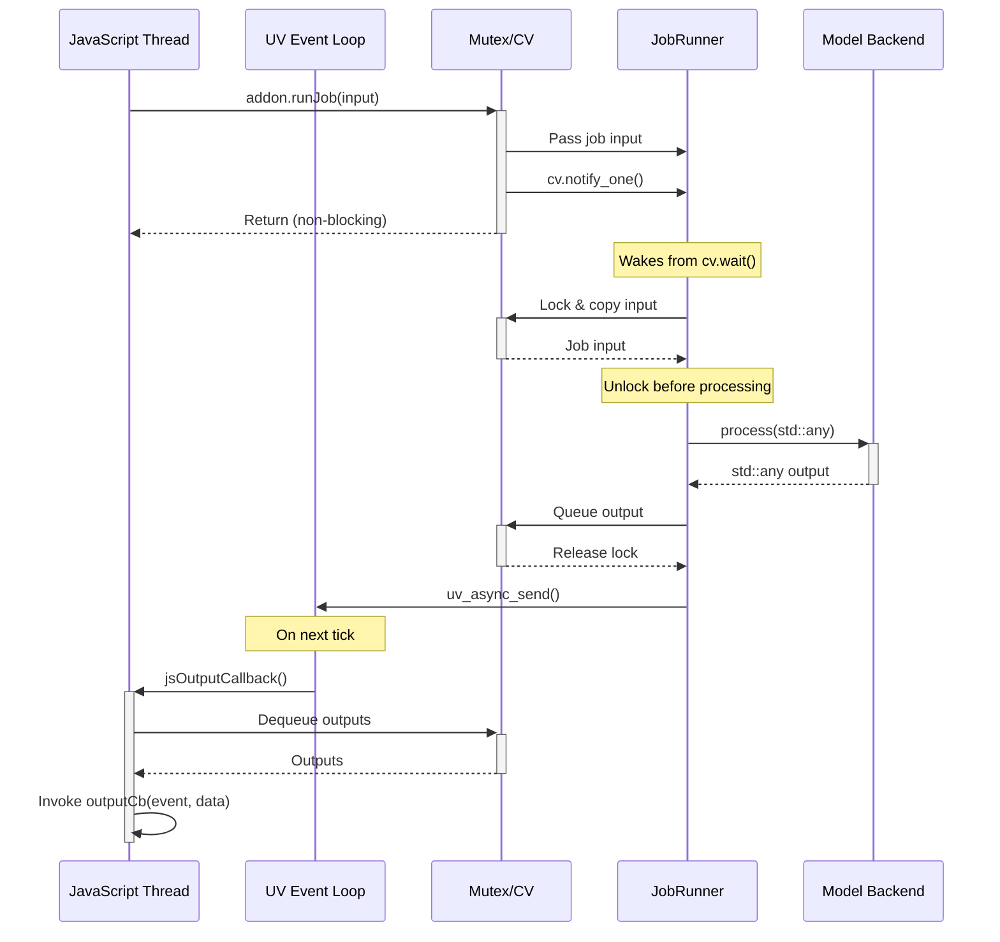
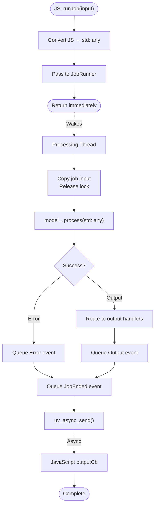

# Detailed Data Flows

> ⚠️ **Warning:** These diagrams can become outdated as code evolves.  
> For debugging, consider regenerating flow diagrams from actual code execution or recent code analysis rather than relying solely on these static diagrams.

This document describes how data moves through the `inference-addon-cpp` system, including the primary inference path and weight loading flow.

**Audience:** Developers debugging complex behavior, contributors understanding system interactions.

<details>
<summary>⚡ TL;DR: Data Flow Overview</summary>

**Communication Pattern:**
- Two-thread architecture: JavaScript thread + dedicated processing thread
- Synchronization via mutex and condition variables
- Cross-thread communication: JS → runJob → wake C++ thread → process → output → uv_async_send → JS callback

**Inference Path:**
- JS calls `runJob(input)` → converts JS type to `std::any` → passes to JobRunner
- JobRunner calls `model->process(std::any)` on processing thread
- Model returns `std::any` output
- Output queued as `std::any` → output handlers match by type via `canHandle()`
- Triggers JS callback asynchronously

**Weight Loading:**
- JavaScript sends model weights in chunks (streaming, zero-copy)
- C++ creates std::streambuf over JS ArrayBuffers
- Model backend reads weights via stream interface
- Supports sharded models (GGUF multi-file)

</details>

## Table of Contents

- [Communication Pattern](#communication-pattern)
- [Primary Inference Path](#primary-inference-path)
- [Weight Loading Flow](#weight-loading-flow)

---

## Communication Pattern

This sequence diagram shows the cross-thread communication between JavaScript and the native processing thread:



**Key Points:**
- JavaScript calls are non-blocking - they submit work and return immediately
- Mutex is released before `model->process()` to allow cancellation
- Processing happens while mutex is unlocked
- `uv_async_send()` wakes the JavaScript thread to invoke callbacks

<details>
<summary>📊 LLM-Friendly: Communication Steps</summary>

**Detailed Step-by-Step Communication Flow:**

**Phase 1: Job Submission (JavaScript → C++)**

1. **JS Thread:** User calls `addon.runJob(input)`
2. **JS Thread:** JsInterface converts JS type to `std::any`
3. **JS Thread:** Passes input to JobRunner
4. **JS Thread:** Signals condition variable
5. **JS Thread:** Returns immediately (non-blocking)

**Phase 2: Processing (C++ Background Thread)**

6. **JobRunner:** Wakes from `cv.wait()`
7. **JobRunner:** Acquires mutex and job input
8. **JobRunner:** Releases mutex **before processing**
9. **JobRunner:** Calls `model->process(std::any input)`
10. **Model:** Executes inference (may take seconds/minutes)
11. **Model:** Returns `std::any` output

**Phase 3: Output Delivery (C++ → JavaScript)**

12. **JobRunner:** Routes output through output handlers
13. **JobRunner:** Acquires mutex, adds output to queue
14. **JobRunner:** Releases mutex
15. **JobRunner:** Calls `uv_async_send()`

**Phase 4: Callback Invocation (JavaScript Thread)**

16. **UV Event Loop:** Schedules async callback on next tick
17. **JS Thread:** Async callback fires
18. **JS Thread:** Drains output queue
19. **JS Thread:** Invokes `outputCb(event, data)` for each output

**Key Design Decision: Lock Released During Processing**

The mutex is released before calling `model->process()`. This allows:
- `cancelJob()` to acquire the lock and call `model->cancel()`
- Other threads to check job status
- No blocking of JavaScript thread during processing

</details>

---

## Primary Inference Path

This flowchart shows the flow of a job from JavaScript through processing to output:



### Flow Steps Explained

**JavaScript Side:**
1. **Convert** - Convert JavaScript value to `std::any`
2. **Submit** - Pass to JobRunner
3. **Return** - Immediately return (non-blocking)

**Processing Thread:**
1. **Wake** - JobRunner wakes from wait
2. **Copy Input** - Copy job input while holding lock
3. **Release Lock** - Release mutex before processing
4. **Process** - Call `model->process(std::any)`
5. **Route Output** - Output handler converts `std::any` result
6. **Queue Events** - Queue Output and JobEnded events
7. **Trigger Callback** - Call `uv_async_send()`

**JavaScript Callback:**
- Invoked asynchronously via `uv_async_send()`
- Output handlers receive `std::any` and match based on the contained type
- Each handler checks `canHandle(std::any)` to determine if it can process the output

<details>
<summary>📊 LLM-Friendly: Inference Flow Breakdown</summary>

**Model Interface:**

The model implements `IModel::process(const std::any& input) → std::any`:

```cpp
class MyModel : public model::IModel {
  std::any process(const std::any& input) override {
    // Extract actual type from std::any
    auto text = std::any_cast<std::string>(input);
    
    // Do inference
    std::string result = doInference(text);
    
    // Return as std::any
    return std::any(result);
  }
};
```

**Output Handler Role:**

Output handlers convert `std::any` to appropriate format:
- For C++: Store in container (`CppContainerOutputHandler`)
- For JavaScript: Convert to JS value (`JsStringOutputHandler`)

**Error Handling:**

- **Model throws exception:** JobRunner catches, queues `Output::Error`
- **Type mismatch in std::any_cast:** Exception thrown, caught and queued as `Output::Error`
- **Cancellation:** Model's `cancel()` called, model throws, error queued

**Output Types (std::any containing):**

| Type | When Queued | Handler |
|------|-------------|---------|
| Model output type (e.g., `std::string`) | Model returns from `process()` | Matched by output handler (e.g., `JsStringOutputHandler`) |
| `Output::Error` | Exception caught | `CppErrorOutputHandler` or JS equivalent |
| `RuntimeStats` | Job ends or exception | `CppRuntimeStatsOutputHandler` or JS equivalent |
| `Output::LogMsg` | Model logs message | `CppLogMsgOutputHandler` or JS equivalent |

</details>

---

## Weight Loading Flow

The streaming weight loading process allows large model files to be loaded incrementally from JavaScript without excessive memory copies:

### Steps

1. **JavaScript** sends chunks via `addon.loadWeights(handle, chunk)`
   ```javascript
   addon.loadWeights(handle, {
     filename: 'model.gguf',
     chunk: Uint8Array,      // Weight data
     completed: false         // More chunks coming
   })
   ```

2. **JsInterface** extracts chunk metadata and passes to model's `setWeightsForFile()`

3. **WeightsLoader** accumulates chunks:
   - Stores JS references to ArrayBuffer underlying each Uint8Array
   - Builds list of blob pointers and sizes
   - Waits for `completed: true` signal

4. When `completed: true` received, creates `FinalizedStream<char>`:
   - Creates `BlobsStream<char>` implementing `std::basic_streambuf<char>`
   - Supports seeking across multiple concatenated blobs

5. **Model** receives `std::basic_streambuf<char>*`:
   - Model backend reads weights synchronously
   - Zero-copy access to JavaScript-owned memory

6. **Cleanup**:
   - Uses `ThreadQueuedRefDeleter` to defer `js_delete_reference()`
   - Cannot delete from processing thread (JS API requires env thread)

7. **References deleted** on next lock acquisition by same thread:
   - JavaScript thread processes deletion queue during next API call
   - Ensures JS references cleaned up on correct thread

### Memory Lifecycle

```
JS: Create Uint8Array
    ↓
JS: addon.loadWeights(chunk)  → C++: js_create_reference()
    ↓                               ↓
JS: Continue execution         C++: Store ref in WeightsLoader
    ↓                               ↓
JS: Send final chunk           C++: Create FinalizedStream
    ↓                               ↓
JS: Continue execution         C++: Model loads weights (zero-copy)
    ↓                               ↓
JS: Next API call              C++: Mark for deletion (ThreadQueuedRefDeleter)
    ↓                               ↓
JS: API call returns           C++: js_delete_reference() on JS thread
    ↓
JS: GC can collect ArrayBuffer
```

### Sharded Model Support

For models split into multiple files (e.g., GGUF shards), the `GGUFShards` helper expands patterns:

```cpp
// Input: "model-00001-of-00005.gguf"
// Expands to:
// - model-00001-of-00005.gguf
// - model-00002-of-00005.gguf
// - model-00003-of-00005.gguf
// - model-00004-of-00005.gguf
// - model-00005-of-00005.gguf
```

JavaScript sends data in chunks, and C++ concatenates them into a single logical stream.

<details>
<summary>📊 LLM-Friendly: Weight Loading Steps</summary>

**Component Responsibilities:**

| Component | Role | Key Operations |
|-----------|------|----------------|
| JavaScript | Chunk Provider | Read file, create Uint8Array, call loadWeights() |
| JsInterface | Validation | Extract filename, chunk, completed flag |
| WeightsLoader | Accumulation | Store JS refs, build blob list, create stream |
| FinalizedStream | Ownership | Take JS refs, provide streambuf interface |
| BlobsStream | I/O | Implement std::streambuf (read, seek) |
| Model Backend | Consumer | Read weights via stream, load into memory |
| ThreadQueuedRefDeleter | Cleanup | Defer js_delete_reference() to JS thread |

**Step-by-Step Weight Loading:**

**JavaScript Side:**

1. **Read Model File**
   - Open file handle (fs.createReadStream or fetch)
   - Read chunks (e.g., 10 MB at a time)
   - Create Uint8Array for each chunk

2. **Send Chunks**
   ```javascript
   addon.loadWeights(handle, {
     filename: 'model.gguf',
     chunk: uint8Array,       // Data
     completed: false          // More coming
   })
   ```

3. **Send Final Chunk**
   ```javascript
   addon.loadWeights(handle, {
     filename: 'model.gguf',
     chunk: lastChunk,
     completed: true           // Signal completion
   })
   ```

**C++ Side:**

4. **Receive Chunk (JsInterface)**
   - Extract filename string
   - Get ArrayBuffer underlying Uint8Array
   - Extract completed boolean
   - Create JS reference to ArrayBuffer (`js_create_reference()`)
   - Pass to WeightsLoader

5. **Accumulate (WeightsLoader)**
   - Add chunk to `shards_in_progress[filename]`
   - Store: (JS ref, data pointer, size)
   - If `completed == false` → wait for more chunks
   - If `completed == true` → finalize stream

6. **Finalize Stream**
   - Create `FinalizedStream<char>`
   - Transfer all JS references (RAII ownership)
   - Create `BlobsStream<char>` implementing std::basic_streambuf
   - Return stream to Addon

7. **Load Weights (Model Backend)**
   - Addon passes `std::basic_streambuf<char>*` to model
   - Model reads via stream interface (read(), seekg(), etc.)
   - **Zero-copy:** Direct access to JavaScript ArrayBuffer memory
   - Can seek within stream across blob boundaries

8. **Cleanup (After Load)**
   - Model loading complete
   - Mark JS references for deletion
   - `ThreadQueuedRefDeleter` queues deletion
   - Next API call from JS thread → process deletion queue
   - Call `js_delete_reference()` on JS thread
   - JavaScript GC can now collect ArrayBuffers

**Memory Management Flow:**

| Stage | JS ArrayBuffer State | C++ Reference State | Notes |
|-------|---------------------|---------------------|-------|
| Initial | Created by JS | None | Data in JS memory |
| loadWeights() call | Passed to C++ | js_create_reference() | Pinned from GC |
| Accumulation | Still in JS heap | Stored in vector | Multiple refs held |
| Stream finalized | Still in JS heap | Owned by FinalizedStream | RAII wrapper |
| Model reading | Still in JS heap | Active | Zero-copy access |
| Load complete | Still in JS heap | Marked for deletion | Queued cleanup |
| Next JS API call | Still in JS heap | js_delete_reference() | Unpinned |
| After API returns | May be GC'd | None | Memory freed |

**Sharded Model Handling:**

Input pattern: `model-00001-of-00005.gguf`

GGUFShards expands to:
1. `model-00001-of-00005.gguf`
2. `model-00002-of-00005.gguf`
3. `model-00003-of-00005.gguf`
4. `model-00004-of-00005.gguf`
5. `model-00005-of-00005.gguf`

JavaScript sends each file separately with unique filename. C++ concatenates blobs into single logical stream.

**Error Handling:**

| Error | Detection Point | Action |
|-------|----------------|--------|
| Invalid chunk structure | JsInterface | Throw JavaScript exception |
| Missing filename | JsInterface | Throw JavaScript exception |
| Not Uint8Array | JsInterface | Throw JavaScript exception |
| Stream read error | BlobsStream | Set failbit, model reports error |
| JS ref deletion on wrong thread | ThreadQueuedRefDeleter | Queue for JS thread |

</details>

---

**Related Documents:**
- [architecture.md](architecture.md) - Main architecture documentation

**Last Updated:** 2025-12-15
